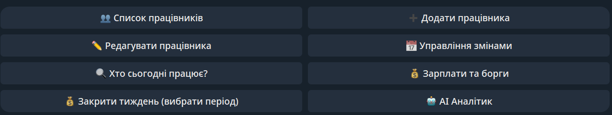

# 🤖 SVOI AI Restaurant Business Analyst & Telegram Bot

> **Enterprise-grade** автоматизована система бізнес-аналітики для ресторану на базі Telegram, хмарного сховища даних (Data Lake), PostgreSQL та LLM (AI-агента).

---

## 📌 Про проєкт
Цей проєкт створений для автоматизації управлінської звітності, аналізу продажів, контролю ефективності персоналу та оптимізації витрат ресторану. Система дозволяє керівництву у будь-який момент часу отримати глибокі бізнес-інсайти та відповіді на складні запитання природною мовою через звичайний Telegram-бот.

Головна мета проєкту — перетворити сирі дані у прийняття бізнес-рішень за лічені секунди за допомогою технологій Data Engineering та Generative AI. 

*Проєкт розроблений на основі реальних даних ресторанного бізнесу (дані чеків та операцій реального закладу з дотриманням умов конфіденційності та анонімізації). Архітектура оптимізована під реальні навантаження та комерційне використання.*

---

## 🔄 Пайплайн даних (Data Flow)
1. **Ingestion:** Збір сирих даних з ресторанної системи (Syrve).
2. **Storage:** Зберігання у хмарному сховищі даних (**Data Lake** на базі Cloudflare).
3. **Processing & Modeling:** Попередня обробка та трансформація у метадані / аналітичні таблиці **PostgreSQL (Neon Cloud)**.
4. **Serving Layer:** AI-агент на базі Groq API обробляє запити користувача, генерує та виконує SQL, після чого надсилає структуровану бізнес-відповідь у **Telegram**.

---

## 🏗 Архітектура та стек технологій

Проєкт побудований на сучасній стековій архітектурі:
* **Мова програмування:** Python 3.10+ (AsyncIO, Aiogram 3)
* **База даних та метадані:** PostgreSQL (Neon Cloud)
* **Сховище даних (Data Lake):** Хмарне сховище для сирих та оброблених даних (Cloudflare)
* **AI / LLM Layer:** Groq API (`openai/gpt-oss-20b` / Llama-based models) для Text-to-SQL та бізнес-інсайтів
* **Контейнеризація:** Docker & Docker Compose
* **Архітектурні патерни:** Text-to-SQL Pipeline, Self-Correction (Самовідновлення запитів), Guardrails (Захисні бар'єри)

---

## 📊 Структура бази даних та вітрин (Data Warehouse Layer)

Архітектура включає сирий шар даних, проміжні таблиці (`silver_*`) та агреговані вітрини (`gold_*`) для швидкої аналітики:
* `syrve_employees` — довідник працівників та їхніх ставок.
* `staff_shifts` — облік відпрацьованих змін і виплат.
* `silver_guest_checks` — деталізовані гостьові чеки, страви, категорії та знижки.
* `gold_daily_sales` — щоденні агреговані продажі та виторг.
* `gold_top_dishes` — рейтинг найпопулярніших та найприбутковіших страв.
* `gold_cashier_performance` — ефективність і продуктивність касирів.
* `gold_revenue_by_category` — виручка та продажі в розрізі категорій меню.

---

## 🧠 Ключові особливості та фічі AI-агента

* **Динамічний Text-to-SQL:** Транслює звичайні запитання користувача з Telegram у чисті, оптимізовані SQL-запити до PostgreSQL.
* **Механізм самовиправлення (Self-Correction):** Якщо база даних повертає синтаксичну помилку, агент автоматично передає помилку разом із запитом назад до LLM, коригує код та виконує його повторно без збоїв для користувача.
* **Суворі Guardrails (Безпека):** Блокування будь-яких небезпечних операцій (`DELETE`, `UPDATE`, `DROP`) на рівні коду — агент має права виключно на `SELECT`.
* **Захисні умови (Guard Clauses):** Валідація порожніх результатів вибірки з наданням коректних сповіщень користувачу.
* **Бізнес-рекомендації:** Агент не просто видає сухі цифри, а генерує маркетингові поради, пропозиції щодо оптимізації ціноутворення, комбо-акцій та управління фондом оплати праці.
* **Контроль доступу та безпека (Whitelist Access Control):** Реалізовано механізм перевірки користувачів за списком дозволених ID (Whitelist). Сторонні користувачі не мають доступу до конфіденційних фінансових звітів компанії — бот блокує запити від неавторизованих акаунтів.
* 
---

## 💬 Приклади запитань до бота (Prompt Examples)

Агент підтримує запити різної складності — від базової статистики до стратегічних бізнес-рекомендацій:

### 🟢 Рівень 1: Базова фінансова та товарна аналітика
* *«Які топ-3 страви приносять найбільше грошей за весь час?»*
* *«Скільки замовлень та який загальний дохід був у нас по днях тижня?»*
* *«Яка категорія страв принесла найбільше виручки?»*

### 🟡 Рівень 2: Операційний облік та персонал
* *«Хто з працівників обробив найбільше замовлень і приніс найбільше виручки?»*
* *«Скільки всього змін було відпрацьовано і скільки з них уже оплачено?»*
* *«Хто з касирів має найвищий середній чек?»*

### 🔴 Рівень 3: Глибокі бізнес-інсайти та рекомендації (AI Advisor)
* *«Проаналізуй наші топ-страви та категорії. Дай свій експертний коментар: які позиції виглядають недооціненими (де можна підняти ціну), а які варто просувати через комбіновані акції?»*
* *«Оціни результати роботи касирів та запропонуй структуру бонусної системи для мотивації команди.»*
* *«Виходячи з показників продажів та днів із найменшою активністю, запропонуй 3 конкретні кроки для збільшення виручки наступного місяця.»*

  

